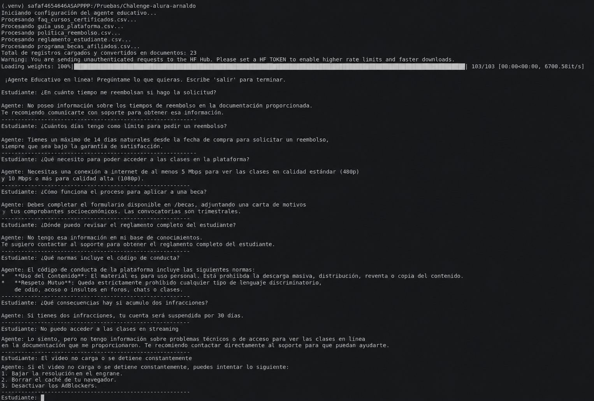
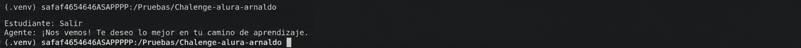
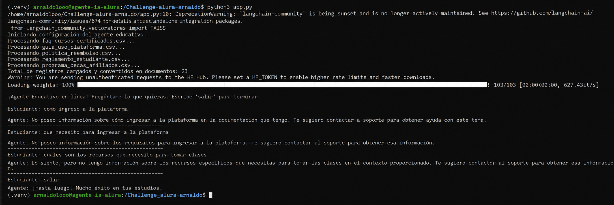

# Agente de IA para Plataforma Educativa (RAG)

Repositorio de Agente Educativo de IA, armado como parte del Challenge de Alura Latam. Es un asistente virtual interactivo que utiliza una arquitectura RAG (Retrieval-Augmented Generation) para resolver las dudas de los estudiantes sobre la documentación, reglamentos, becas y políticas de la plataforma.

---

## Descripción General

El agente se encarga de leer un montón de archivos `.csv` que hacen de base de conocimiento, aplicando búsqueda semántica para rescatar solo los fragmentos que posta sirven para responderle al alumno. A partir de ahí, arma una respuesta clara, y al pie, basándose únicamente en la información que tiene a mano.

### Características Principales:
* **Lectura y unificación multifuente:** Carga automáticamente información desde distintos archivos CSV (FAQs, guías, políticas de reembolso, reglamentos y programas de becas).
* **Búsqueda Vectorial Local:** Convierte los documentos en vectores (embeddings) de forma local y los almacena en memoria usando FAISS para garantizar rapidez y costo cero en la vectorización.
* **Respuestas Guiadas (RAG):** Utiliza Google Gemini para redactar las respuestas finales basándose solo en la información documental disponible.

---

## Arquitectura de la Solución

El flujo de procesamiento sigue una arquitectura RAG estándar dividida en 4 fases principales:

[ Archivos CSV ] ──> [ Procesamiento & Chunking ] ──> [ Embeddings Locales (Hugging Face) ]
│
▼
[ Usuario (Consola) ] ──> [ Consulta (Input) ] ─────────> [ Base Vectorial (FAISS) ]
│
▼
Contexto Relevante (k=3)
│
▼
[ Respuesta Final ] <────── [ Google Gemini LLM ] <────── [ Prompt del Sistema + Contexto ]

1. **Ingesta de Datos:** Se leen los archivos CSV con `pandas` y se convierten en objetos `Document` de LangChain combinando columnas clave y metadatos.
2. **Indexación y Búsqueda:** Los documentos se dividen en fragmentos mediante `RecursiveCharacterTextSplitter`. Luego, `HuggingFaceEmbeddings` calcula sus vectores numéricos y `FAISS` crea el índice de búsqueda por similitud.
3. **Recuperación (Retrieval):** Ante una pregunta del usuario, el *retriever* extrae los 3 fragmentos de texto más relevantes ($k=3$).
4. **Generación (LLM):** Un modelo `gemini-2.0-flash` recibe la pregunta junto con el contexto relevante recuperado y redacta una respuesta coherente.

# Tecnologías y herramientas utilizadas
* **Lenguaje:** Python 3.12+
* **Framework RAG:** LangChain (`langchain-core`, `langchain-community`, `langchain-google-genai`, `langchain-huggingface`)
* **Modelo de Lenguaje (LLM):** Google Gemini (`gemini-2.0-flash`) via `GoogleGenerativeAI`
* **Modelo de Embeddings:** Hugging Face (`sentence-transformers/all-MiniLM-L6-v2`) — *Ejecución 100% Local*
* **Base de Datos Vectorial:** FAISS (`faiss-cpu`)
* **Procesamiento de Datos:** Pandas

## Cómo ejecutar el proyecto

### Pre-requisitos
* Tener instalado Python 3.10 o superior.
* Contar con una API Key de Google Gemini (puedes obtenerla gratis en [Google AI Studio](https://aistudio.google.com/)).

### 1. Clonar el repositorio
```bash
git clone [https://github.com/arnaldorcm/Challenge-alura-arnaldo.git](https://github.com/arnaldorcm/Challenge-alura-arnaldo.git)
cd Challenge_Alura
```

### Se debe crear y activar un entorno virtual con los siguientes comandos:

```bash
python3 -m venv .venv
source .venv/bin/activate  # En Linux/macOS
# .venv\Scripts\activate    # En Windows 
```

### Instalar dependencias 

```bash
pip install -r requirements.txt
```

### Configurar el API KEY 
```bash
linux: 
export GEMINI_API_KEY="tu_api_key_aqui"
Windows: 
setx GEMINI_API_KEY "tu_api_key_aqui"
```

### Ejecucion de la aplicación 

```bash
python3 app.py
```
## Ejemplos de Preguntas y Respuestas

### Ejemplo 1: Consulta sobre Certificados y Cursos
* **Estudiante:** ¿Qué requisitos necesito para obtener mi certificado de aprobación?
* **Agente:** Para obtener tu certificado debes finalizar el 100% de las lecciones del curso y obtener una calificación mínima de 80/100 en el proyecto final o evaluación integradora.

### Ejemplo 2: Consulta fuera de la documentación (Manejo de casos no cubiertos)
* **Estudiante:** ¿Tienen clases presenciales en Paraguay?
* **Agente:** Hola. No poseo información sobre clases presenciales dentro de la documentación disponible, ya que nuestra oferta es 100% en línea. Te sugiero contactar directamente al equipo de soporte para obtener más detalles.
### Ejemplo 3: Consulta sobre Políticas de Reembolso
* **Estudiante:** ¿Cuál es el plazo máximo para pedir un reembolso?
* **Agente:** De acuerdo con la política de reembolso de la plataforma, el plazo máximo para solicitar un reembolso completo es dentro de los primeros 7 días naturales posteriores a la fecha de compra del curso.

---

## Capturas de Pantalla / Evidencias





## (Terminal en la Nube)

